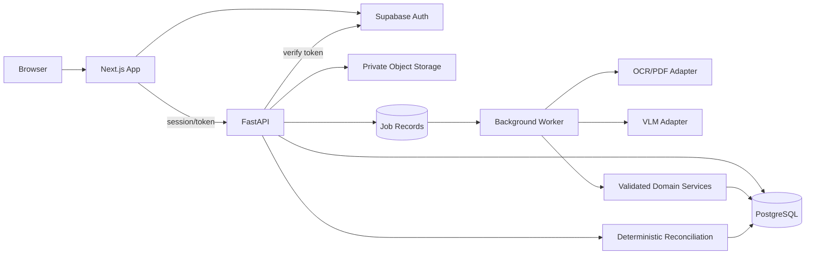
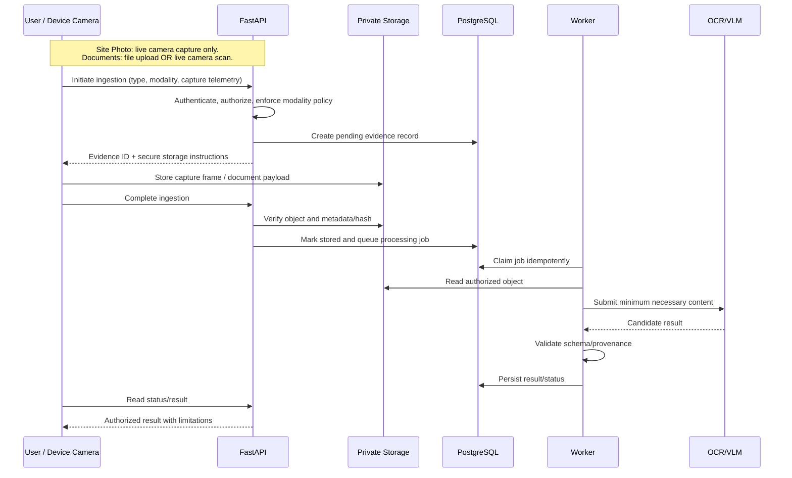

# 02 — System Architecture

## Goals and components
Separate presentation, identity, domain rules, AI processing, storage, and consequential decisions. Keep calculations deterministic, AI replaceable, tenant boundaries explicit, and findings traceable to versioned sources.

- **Next.js:** public homepage, authenticated shell, forms, tables, status/review UI; not the authority for domain rules.
- **3D landing module:** client-only Three.js/R3F scene loaded dynamically only on `/`.
- **Supabase Auth:** identity/session issuance.
- **FastAPI:** token verification, authorization, validation, orchestration, and service entry points.
- **Domain services:** projects, milestones, evidence, documents, inventory, reconciliation, findings, investigations, decisions, certificates.
- **PostgreSQL:** operational state, constraints, tenant ownership, job status, snapshots, audit events.
- **Private object storage:** evidence and reports; database stores object keys/metadata, not public URLs.
- **Worker process:** asynchronous OCR/VLM and report jobs. MVP may use a safely claimed database-backed job table; add Celery/Redis only when justified.
- **External providers:** replaceable OCR/VLM adapters with timeouts, quotas, validation, and safe telemetry.

## Component diagram

## Trust boundaries
1. Browser inputs, IDs, roles, metadata, and files are untrusted.
2. Auth proves identity, not project access.
3. FastAPI verifies token and resolves membership/permission on every protected action.
4. Storage stays private; issue short-lived authorized URLs or controlled ingestion instructions. Enforce modality policy: site progress photos strictly require authenticated live camera capture sessions (file upload rejected); vendor documents accept both file upload and live camera scanning.
5. OCR/VLM responses are untrusted and schema-validated.
6. Database constraints do not replace service authorization.
7. Clearance is a distinct action with eligibility checks and audit history.

## Request lifecycle
1. Client sends bearer token where required.
2. API verifies signature, issuer, expiry, and applicable claims.
3. Authorization dependency resolves active membership and project scope.
4. Pydantic validates shape and ingestion modality; domain service validates business rules.
5. Service executes a transaction as needed.
6. Long-running work creates an idempotent job and returns a job ID.
7. Sensitive mutation creates an audit event.
8. Response follows `11_API_CONTRACTS.md`.

## Evidence sequence

## Jobs, retries, and idempotency
Persist `queued`, `running`, `succeeded`, `failed`, `cancelled`, attempt count, retry time, timestamps, safe error code, provider/model and output reference. Claim atomically or use a queue preventing concurrent duplicate processing. Retry transient errors with bounded exponential backoff/jitter; do not retry permanent validation errors. Recover stale `running` jobs via lease/timeout. Queue delivery can be at-least-once, so writes must be idempotent.

A database-backed worker is acceptable for an MVP if locking/claiming is safe. Add Celery/Redis when throughput or scheduling justifies the operational cost. Keep job state in PostgreSQL regardless.

## Data and storage consistency
PostgreSQL owns structured operational records; object storage owns bytes. Since a database transaction cannot atomically commit storage, use explicit pending/failed states and cleanup for abandoned uploads. Never mark evidence validated before verifying storage and file bytes. Historical baseline/reconciliation/decision/certificate versions remain immutable or append-only.

## Observability
Use request/job correlation IDs and structured logs with safe actor/project/action/outcome/duration fields. Track queue depth, processing duration, provider errors, retry count, upload failures, and API errors. Health/readiness responses must not reveal credentials. Redact tokens, signed URLs, source content, and secrets.

## 3D isolation
Use a dynamic import with server rendering disabled for the WebGL scene. It must not be imported by root/auth/dashboard layouts. Verify build chunks: dashboard and login must not download Three.js scene code/assets. WebGL failure uses a static fallback while copy and CTAs remain usable.

## Deployment topology and decisions
Deploy Next.js, FastAPI, database/storage, and worker as distinct logical services. Configure TLS, CORS allowlist, secrets, backups, and migrations. Use a modular monolith backend for MVP rather than premature microservices. Use deterministic reconciliation for auditability, candidate AI observations for uncertainty, database-backed job status for visibility, and 3D only on the public homepage.
