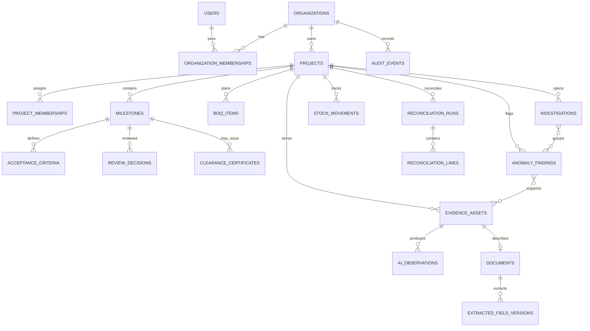

# 06 — Database Schema

## Principles
PostgreSQL is authoritative for structured operational state. Use UUID primary keys, UTC `TIMESTAMPTZ`, foreign keys, constraints, tenant ownership, and migrations. Use `NUMERIC`/Python `Decimal` for authoritative quantities and money. Preserve raw source values alongside normalized/corrected values. Audit-critical records must not be silently overwritten.

## Core relationship diagram

## Common conventions
Mutable records generally use `created_at`, `updated_at`, and `created_by`. Immutable events/results use `created_at` and actor/context references without casual updates. Every tenant-owned row has `organization_id` or a guaranteed parent path enforced in queries and policies. If organization IDs are duplicated on child rows for RLS/query efficiency, ensure they match parents via composite FKs, triggers, or strict database/service validation.

## Canonical tables and fields
- **`user_profiles`**: `id` matching verified identity subject, `display_name`, optional email/avatar, timestamps, `disabled_at`. Supabase Auth owns credentials; never store duplicate passwords.
- **`organizations`**: `id`, `name`, normalized unique `slug`, `status`, `created_by`, timestamps.
- **`organization_memberships`**: `id`, `organization_id`, `user_id`, `role` (`org_admin`, `project_manager`, `project_auditor`, `site_supervisor`, `store_in_charge`, optional `viewer`), `status`, inviter/join timestamps. Index `(organization_id,user_id,status)`; enforce active membership uniqueness.
- **`projects`**: `id`, `organization_id`, name/code/description, timezone, currency code, status, optional planned dates, current baseline version, creator/timestamps. Project code unique within organization when provided.
- **`project_memberships`**: organization/project/user IDs, project role or permission set, status, assigner/timestamps; unique project/user. Ensure organization and project agree.
- **`project_baseline_versions`**: project, version number, effective time, creator, change reason, snapshot hash. Unique `(project_id,version_number)`; reconciliation runs reference a snapshot.
- **`milestones`**: project, code/name/description, planned dates, status, current criteria version. Unique project/code; status is not proof of completion.
- **`acceptance_criteria`**: milestone/project, version, criterion code/description, required evidence types, verification method, required/active, creator. Unique milestone/version/code.
- **`units_of_measure`**: code, display name, dimension (`mass`, `volume`, `length`, `area`, `count`, `time`, `other`), canonical flag and only globally valid conversion factor. No incompatible conversions.
- **`materials` / `material_aliases`**: canonical code/name/category/dimension plus scoped aliases, optional vendor/source system, approval provenance. Ambiguous mappings are review candidates.
- **`boq_items`**: project/baseline, item code/description, optional material, planned quantity `NUMERIC(20,6)`, unit, optional unit price/currency, approved wastage rate, optional milestone. Validate nonnegative quantities and policy bounds.
- **`vendors` / `contractors`**: organization, external code, legal/display/normalized name, only necessary contact fields, active status. Avoid overconfident identity merges.
- **`evidence_assets`**: organization/project/milestone, uploader, evidence type, original filename (display only), random object key, detected media type, byte size, SHA-256, upload status, claimed capture time, storage verification time, bounded metadata, notes, optional parent version. Object key unique; private storage; immutable final hash.
- **`evidence_processing_jobs`**: evidence/project, job type/status, attempt/max attempts, idempotency key, pipeline/provider/model versions, start/end/retry timestamps, safe error fields, output reference. Index status/retry and project/evidence; unique scoped idempotency key.
- **`ai_observations`**: evidence/project/milestone, job, observation type/text, optional criterion/region, optional confidence with semantics, limitations, provider/model/prompt/schema versions, review status. Model output is immutable; decisions/corrections are separately versioned.
- **`documents`**: evidence ID unique, type (`invoice`, `purchase_order`, `delivery_challan`, `goods_receipt`, `other`), raw/normalized document number, vendor reference, date/currency, processing status. Document number is not globally unique by assumption.
- **`extracted_field_versions`**: document, field name, raw text/value, normalized value, page/source span, extraction method, confidence semantics, pipeline version, field version, review status, reviewer/time/reason. Unique document/field/version; never overwrite original extraction.
- **`purchase_orders` / `purchase_order_lines`**: vendor, project, PO number/date/currency/status/source doc; lines contain material, raw description, ordered quantity/unit, unit price, tax/discount fields as needed, source/computed line totals. Validate arithmetic without overwriting source values.
- **`delivery_challans` / `delivery_challan_lines`**: vendor/project/number/date/source doc/optional PO; lines with material, raw description, quantity/unit, optional linked PO line. Support partial deliveries.
- **`goods_receipts` / `goods_receipt_lines`**: project/store/date/source evidence/receiver/status; lines with material, received quantity/unit, optional challan line and condition. Challan is not proof of physical receipt.
- **`inventory_locations`**: project, code/name/type/active; unique code per project.
- **`stock_movements`**: project/material/location, movement type (`opening_balance`, `receipt`, `issue`, `return`, `adjustment`, `transfer_in`, `transfer_out`, `reversal`), one consistently documented signed/directional quantity convention, unit, effective date, source reference, approval state, actor, optional reversed movement. Prefer append-only ledger; corrections use reversal and replacement.
- **`material_issues` / lines**: project/milestone/contractor, issue date/reference/source evidence/status/actor; line material, quantity/unit, receiver, BOQ/milestone, purpose. Issue is not necessarily consumption.
- **`reconciliation_runs`**: project, baseline version, period, input snapshot/hash, algorithm version, status, timestamps, creator, idempotency key, summary/safe error. Changed inputs create a new run.
- **`reconciliation_lines`**: run, rule/line type, material/BOQ, source refs, raw/normalized quantities, unit, expected/observed/delta, tolerance, optional financial values/currency, result status, formula code/explanation. Enough data to reproduce calculation.
- **`anomaly_findings`**: project, type, severity, status, rule/version, subject refs, explanation, calculation, limitations, detected/resolved times. Finding is not an accusation.
- **`finding_evidence_links`**: finding/evidence, relation (`supports`, `contradicts`, `context`), rationale, time.
- **`investigations` / `investigation_findings` / `investigation_activity`**: case number/title/summary/status/owner/severity/open/close; explicit finding relationships; authored comments/activity.
- **`review_decisions`**: project/milestone, decision (`approve`, `request_evidence`, `request_inspection`, `hold`, `reject`, `escalate`), reason, reviewer, criteria version, optional reconciliation run, time, optional superseded decision. Append-only.
- **`clearance_certificates`**: project/milestone, certificate number, decision ID, report object key, snapshot hash, version, status (`issued`, `revoked`, `superseded`), issuer/time and revocation fields. Unique number and milestone/version; issuance requires authorized approved decision and eligibility check.
- **`audit_events`**: organization/project, actor (nullable system actor), action, target type/id, request ID, time, safe metadata, outcome. Append-only for application roles; do not log secrets/content.

## Constraints, indexes, and tenancy
Use foreign keys and check constraints for valid quantities/statuses. Evaluate indexes for tenant/project IDs, `(organization_id,project_id,created_at)`, queue status/retry, normalized vendor/material/document identifiers, evidence hash, milestone/finding status, and reconciliation run IDs. Scope every service query to authorized tenant/project. Test nested child IDs and guessed UUIDs across two organizations. A service-role connection may bypass RLS, so FastAPI must still enforce access.

## Deletion and migration policy
Use deactivation, soft deletion, restricted deletes, or governed retention for audit-critical records. Evidence deletion must coordinate storage, linked records, and legal holds. Retention periods require stakeholder/jurisdiction review. Test clean migrations and upgrades; destructive changes need staged migration and backup plan.
